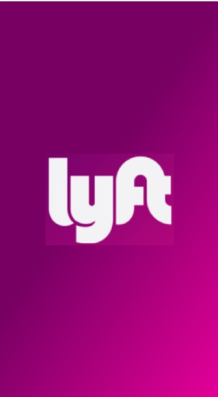
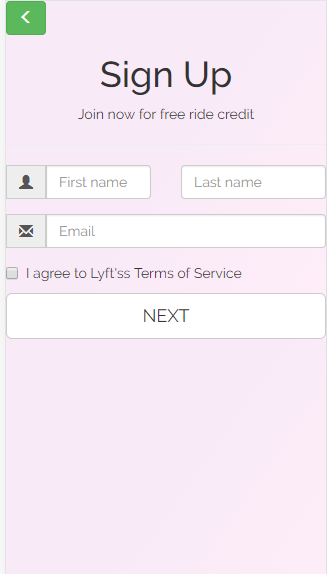

# "LYFT"

## RETO DE CÓDIGO

### OBJETIVO

Desarrolla una web-app que replique el sitio de Lyft, en este reto deberás cumplir los pasos necesarios para que tu usuario pueda registrarse.

### ETAPAS DEL DESARROLLO DEL PRODUCTO

#### PARTE 1

* Se identifica el objetivo a lograr y las tareas a realizar, para priorizar las actividades a realizar.

#### PARTE 2

* Se realiza el sketch (prototipo sencillo).

* Etapa de elaboración del producto en código. Se realizó lo siguiente

Se creó inicialmente un Archivo index. HTML con la vista slash (logo centrado), y posterior las diferentes vistas: register, singup, verify, form y ultimate.

Se creó un archivo main.css donde se encuentran todos los estilos aplicados a todas la partes del body del documento HTML.

Se creó cinco archivos javascript simultáneamente con el HTML, donde se encuentran todos los eventos aplicados , a las diferentes etiquetas.

### PARTE 3

* Se realiza la funcionalidad según lo solicitado en el reto.

### PARTE 4

* Se identifica las fortalezas del proyecto.

Vista inicial con vista slash, cumple lo necesario.
Vista singup, emite un alert con el código aleatorio, para continuar con el proceso.
Vista verify, muestra el código aleatorio.
Vista form, valida los campos a rellenar.

* Se identifica las debilidades del proyecto.

Vista singup, pendiente validar que el número de celular empiece con el dígito 9.
Vista form, el boton submit(NEXT), corregir el responsive, deshabilitar el boton, además redirecciona a la misma vista, pendiente corregir default.

* L. Vanessa Colqui Santos.